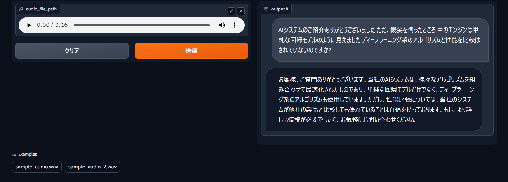

# Wise Respondent


## Overview

Wise Respondent is an application designed to generate fitting responses to voice-based questions.



The application responds to questions according to situational descriptions provided in a JSON format configuration file. For instance, the `config.json` file in this repository contains the following description:

```text
You are a secretary supporting a division head of a well-known Japanese general electronics manufacturer.
The division head is introducing his company's products, but is being asked tough questions about them by customers.
Please give him the appropriate response text in Japanese to overcome this difficulty.
```

## How to use

First, install the required libraries to run `main.py` by executing the following command in your preferred Python environment(recommended Python 3.10):

```sh
pip install -r requirements.txt
```

Next, obtain the `ffmpeg` and `ffprobe` executable files.
If the directory containing these files is not added to your `PATH` environment variable, either set it to your `PATH` or place the executables in the `bin` subdirectory located in the same directory as this file.

Additionally, you will need an OpenAI API key.
Once obtained, enter its value into the configuration file (e.g., `config.json`) you wish to use.

Finally, execute one of the following commands as desired:

```sh
python main.py
```

```sh
python main.py --conf [path of config file you would like to use]
```

## About the sample audio

The sample audio employed by Wise Respondent was generated using [VOICEVOX:ずんだもん(Zundamon)](https://voicevox.hiroshiba.jp/product/zundamon/).
